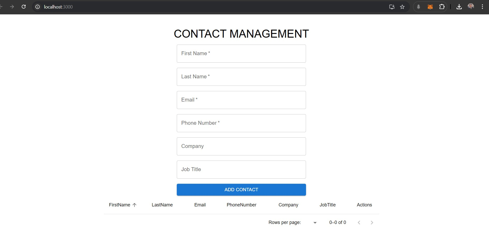
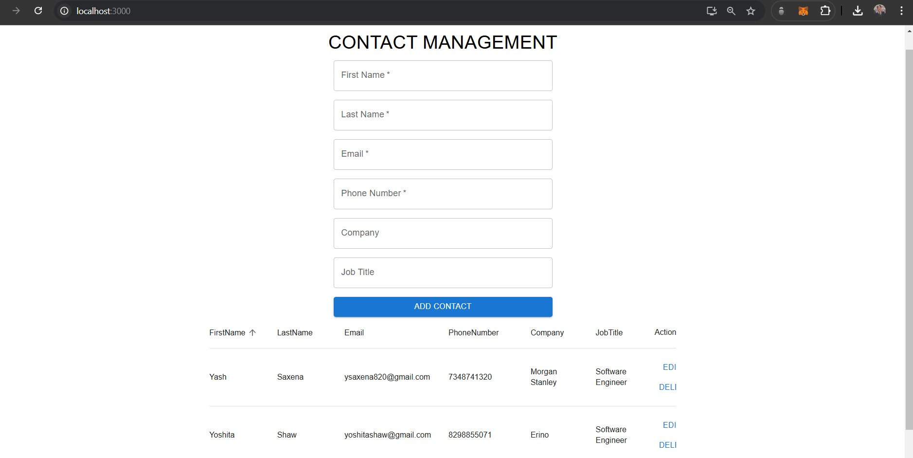

# **Contact Management System**

A simple Contact Management System built with **Express**, **MongoDB**, and **React**. This application allows users to create, view, edit, and delete contact information. It includes pagination, sorting, and filtering features for a better user experience.
The languages and tools used in this webpage are:
[](https://skillicons.dev)

---

## **Features**
- Create, edit, and delete contacts.
- Sort and paginate the contacts list.
- Search for contacts by various fields (e.g., first name, last name).
- Modular codebase with separate frontend and backend.

---

## **Tech Stack Used**

- **Backend (Express)**: Provides RESTful API endpoints to interact with the MongoDB database.
- **Database (MongoDB)**: Stores contacts data. MongoDB's flexible schema allows easy updates and additions of fields.
- **Frontend (React)**: A responsive and interactive interface that enables CRUD operations, pagination, and sorting.
- **Material-UI**: Used for the frontend UI components like tables, pagination, and dialogs.

---

## **Setup Instructions**

### **Prerequisites**
- **Node.js** and **npm** installed on your system.
- **MongoDB** installed and running.

---

### **Backend Setup**
1. **Install dependencies** for the backend:
   ```bash
   cd server
   npm install
2. **Database Setup:** Create a database named contact_management in MongoDB.
3. Start the Backend Server
   ```bash
   npm start
The server should start at http://localhost:5000.

### **Frontend Setup**
1. **Install dependencies** for the frontend:
   ```bash
   cd client
   npm install
2. Start the server for the frontend:
   ```bash
   npm start
The React app should start at http://localhost:3000.

### **CRUD Operations:**
1. **Create:** A form (e.g., in a dialog box) allows users to add a new contact.
2. **Read:** Contacts are displayed in a table with pagination and sorting.
3. **Update:** Users can edit contact information by clicking the "Edit" button, which opens a dialog.
4. **Delete:** Users can delete a contact by clicking the "Delete" button.

Here are some screenshots of the running project.


